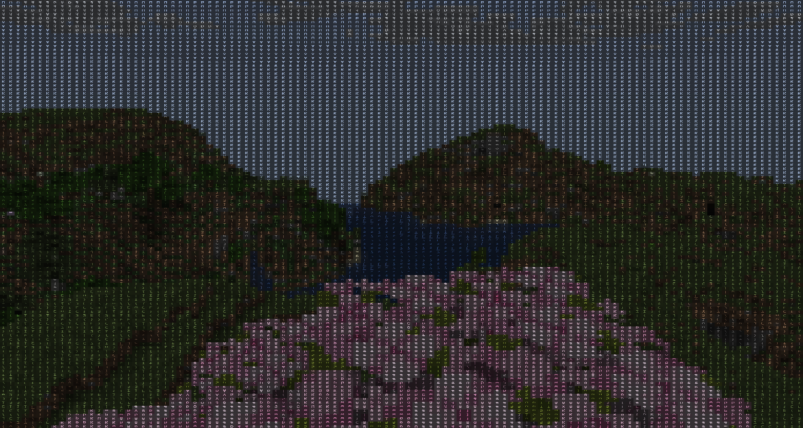
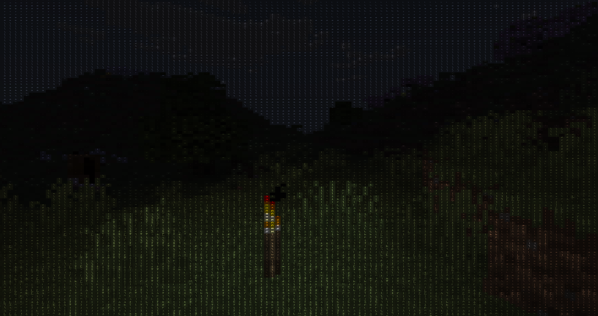

# ASCII Shader

I wondered what Minecraft would look like if every pixel was replaced with ASCII characters, so I made this shader.

This was mostly an experiment to learn GLSL and shader programming. It started as "this sounds funny" and somehow turned into a real project after several hours of fighting brightness values, character atlases, and mysterious shader bugs.

## Features

* Real-time ASCII rendering
* Colored ASCII characters
* Custom-generated ASCII atlas

## Tech Used

* GLSL
* Minecraft shaders
* Python (for generating the ASCII atlas)
* ascpixi/minecraft-shader-template was used 

## What I Learned

* How fragment shaders work
* Texture sampling and UV mapping
* Converting brightness values into character indices
* Why every shader bug somehow turns the screen completely white

## Screenshots 

## Use of ai 
* yes ai was used in this project but only for creating atlas bcs it saves time and formatting this readme cuz idk how to write good md